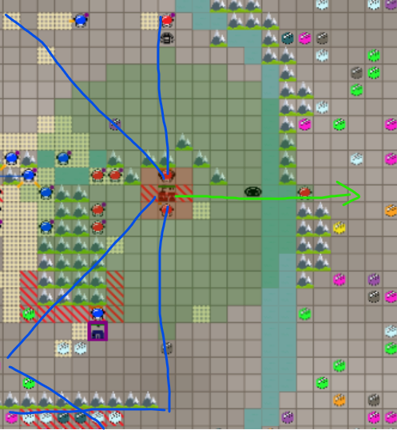

# Strategy

I learned that inventing a new strategy as a bottom-ranked player was a very bad idea. Unless you are the top #1, try to copy the top #1.  

When the top #1 refuses to auto-accept scrimmage, go with the #2 or #3.. Eventually, once you reached the near-top position, the system will schedule a lot of ranked scrimmage with top #1.  

Start inventing new strategy when you cannot copy whatever the better ranked players are doing (or if you are the #1 already).   
Use the rock-paper-scissors thinking framework:
- if the opponent does blind-rush, you blind-rush less, and be more defensive (do not go zero rush!) -- you'll win oxygen
- if they defensive, you be greedy, expand more with settlements (or just astronauts) -- you'll get reinforced suits faster
- if they greedy (trying to hoard 10+ reinforced suits), you rush with fewer reinforced astronauts -- they got killed before collecting too many suits.

## Basic Strategy

### Movement: Basic
Use bug-navigation, copy from someone else's code. In my case, I copied from 1Musketeer's. I also had last year's implementation, but I hated my 1000-lines implementation, and I see 1Musketeer's might be promising.

### Beating the AIC_nullplayer: just catch nearby packages
Implementing rush is tricky, first-thing-first, you should be able to beat the true nullplayer.

### Finding the enemy HQ
Just like the example code by PauMB, send some astronaut to the expected symmetrical location.

### Defense: basic
Only spawn defenders if the enemy is detected by the HQ. Consider what the attackers have: oxygen and reinforced suits. If they have reinforced suits, then adjust the number of the defenders accordingly. If their oxygen level is not enough to reach your HQ, then don't bother spawning defenders.

### Finding enemy HQ
The example code by PauMB covers this: map is symmetry.

### Send some ~~missiles~~ reinforced astronauts to enemy HQ
Just like in real life, people wouldn't send a single nuclear missile to their destroy their enemies, they send hundreds: missiles - even the nuclear ones can be intercepted.

(Reinforced astronaut will be referred as missile, because it's shorter)

!!! NOTE: remember that the map is symmetrical, if you have missiles, then most likely the enemy also has missiles. If you wait until you have 5 missiles, you will be defeated by the enemy who only wait until they have only 4 missiles!

**kyuu_chan strategy:** 4 missiles are enough. 3 missiles can be intercepted easily even if the HQ has zero astronaut at the moment of detection. Sending 5 missiles means you will be destroyed first by those who send only 4, unless you implement some complicated defense strategy.  
My original intention was to always send at minimum 4 missiles, but because of a bug (that had become a feature), only the first batch will be minimum 4, the next missiles will be sent one-by-one. I found that sending missiles one-by-one can do serious damage to the enemy's economy, but it also depends on the map size. I decided not to fix this bug, and let the missiles go one-by-one after the first strike of 4 missiles.

**kyuu_chan special strategy:** *missiles should only hit HQ and nothing else* -- remember that gathering oxygen is the goal of the game, if you have a 32-oxygen missile and they have 10 oxygen defender, if you try to hit them, you will lose 16 oxygen while the enemy only lose 10.

### Movement: Advanced
Your missile strikes can benefit a lot from a properly implemented path finding algorithm. I implemented Parallel-BFS. It doesn't need crazy bytecode optimization, BFS of depth 5 can finish in under 7000 bytecodes. XSquare - one of the people who run AI Coliseum - invented this (I think?). He wrote a PDF explaining how this work. I lost the document, ask him where.

## Communication
This year's AIC got a crazy idea: message queue for communication instead of just simple arrays. Luckily, I implemented something similar at work just few months back.

### Structure of a message
To leverage the message queue for your advantage, the correct structure must be defined:

[Message ID] [Message length] [Recipient ID] [Content]

- Message ID: because there is no array index this year, this is needed to distinguish different messages.
- Message length: no need to actually broadcast this (in some cases, it's needed), we can have constants
- Recipient ID: If empty, it means the message is for everyone -- or rather the sender doesn't know for sure who actually act upon the message.
- Content: could be location, numbers, or whatever.

A single message can be sent in multiple broadcasts if the sender can do that, e.g. HQs, where their radio doesn't explode upon first use. The astronaut can skip the whole message if:
- They don't need to listen to this message ID
- They are not the target recipient

Real example from my code:
1. Message ID = 0x7FFFFFE7 = build settlement
2. Recipient ID = 1234 = an astronaut that just got spawned few bytecodes ago
3. Companion ID = 1235 = the other astronaut who brings oxygen for the new settlement - do not stray too far from each other
4. Target settlement location : x
5. Target settlement location : y
6. Path size = (between 0 - 3) = the length of the path to the target settlement. 
7. x1
8. y1
9. x2
10. y2
11. x3
12. y3

The message may be long, but if an astronaut not interested in listening to this, they only need to read the message ID (or also the recipient ID, only 2).  
In this example, there is a subcontent: the path to the settlement placement. This can further save the bytecode use of the astronauts by not necessarily read all the full-length message.  
However, the HQ must always broadcast the full-length message, padding the end of the message with dummy locations.  
This basically saves astronauts bytecodes at the expense of HQs bytecodes.

## Expansion
Never forget the goal of the game to get the most oxygen or to destroy the enemy.
The more area a player control, the more likely they are able to achieve the goal.
In this context, expansion means expanding the area a player can control. 
An HQ presence or a settlement placement is not an absolute necessity for a player to control an area,
constant presence of astronauts is enough to accomplish this.

### Expand only to profitable area
Lack of hot zones does not necessarily means not profitable, it's just less profitable. This is the formula I used:
- Hot zones is a huge positives
- Being in edge of map is negative point
- Water tiles are negative points each
- Using too much oxygen to reach the area is negative point
- To simplify the calculation, each area started with a fixed positive points
- Do not expand to other HQ. Your other HQ already controlled the that area. If the other HQ is the enemy's, use other strategy to handle it, not expansion strategy.

### Expand like BFS
HQ will send out "surveyors" to measure the profitability of an area. For simplicity, I don't give them purple radio (astronauts die peacefully after fulfilling their duty). The HQ need to specifically tell the surveyors where to go, by sending message with the following format:

1. Message ID = 0X7FFFFFF7 = survey command
2. Recipient ID = 1234 = an astronaut that will become the surveyor
3. Expansion ID = 1235 = area ID. Some "expansion" will be targeted at the same location, will be explained later.
4. Target expansion location : x
5. Target expansion location : y
6. Path size = (between 0 - 3) = the length of the path to the survey area. 
7. x1
8. y1
9. x2
10. y2
11. x3
12. y3

Because we are expanding like BFS, we are able to provide path to the surveyors!  
If surveyor determined that the area profitable, the HQ will keep sending astronaut maintain presence. We will call *expansion workers*.

The first depth of expansion:

Second depth:

Overlapping expansion "point" is fine because the path is different. I expect the astronauts to be able to get different goodies because of the different path.

I reset the "bad" expansions once every 100 rounds, just in case:
- the current HQ successfully built a hyperjump
- the friendly HQ / enemy HQ died  

(I should've reset bad expansion whenever an HQ (enemy/ally) is destroyed or when new hyperjump is built,
waiting until the next 100 rounds cost me one match in grand final!)

The newly opened path also got expanded:

### What expansion workers do
- Move to the expansion point, following the path just like the surveyors do
- If there is a good package along the path, just take it.
- Wait until good packages dropped if reached the expansion point
- If the astronaut running out of oxygen: terraform the expansion point
  - If the expansion point already terraformed: **send message to HQ to delay the next worker from coming here.**

### Build domes at the expansion point
This will save the HQ some oxygen while allowing the astronaut to move deeper in the expansion ~~tree~~ graph.  
Leverage the expansion graph to provide path.  

### Build settlement at the expansion point
We cannot expand too deep because it will be so inefficient, having a settlement structure built at the expansion point will allow better oxygen efficiency. My formula in placing settlement:
- good expansion score/point as explained before
- strong presence of enemy astronauts is a big NO (enemy presence strength calculation explained later)
- as far as possible from the current HQ, and as near as possible to the nearest enemy HQ (the previous bullet point stands!). The nearer it is to the enemy HQ, the better offensive capability it can carry.
- Leverage the expansion graph to provide path

## Defense: Advanced
As said previously, if there is no information about incoming missiles, HQ can only shoot down at most about 3 enemy missiles.  
We can leverage the expansion to create network of defense perimeter.
- Anyone far away from the HQ should try to send alert message to the HQ
  - Astronauts tasked for building things are exempted from this
  - Astronauts attacking enemy HQ should send alert if their oxygen is not enough to reach enemy HQ
  - If they are already nearby allied HQ, just try to attack the attacker
- Purple radio is uneccessary, dying peacefully if permitted
- Do not send alert if the enemy presence is too weak
  - do scoring, 1 points for each astronaut needed to take them down
- Do not send alert if alert already broadcasted for the area
  - it means that every astronauts must listen to every alert
  - do some timing threshold so if it already take too long, send alert again
- HQ then send defenders to the area

HQ can leverage the alerts sent by astronauts to provide scoring when wanting to build settlement or domes:
- Do not build settlement if enemy presence is too recipient
- Do not ever build domes where the enemies can come from
  - Do not build domes if alert never received
  - In grand final matches my lone missile destroyed enemy HQs single-handedly because they placed domes wrongly!

With this defense strategy, 20 missiles-strike may not be enough to take down our HQ!

## Rush strategy: offense is the best defense
The enemy could save up to 30-50 missiles depending on the map hot zones location. In that case, the previous advanced defense strategy
is not good enough.
Furthermore, if they blindly rush our HQ with baloons (astronaut without reinforced suits), that could seriously hurt the economy because instead of
gathering resources, our HQs are too busy keeping their head above the water.
I could not figure out a solid defense strategy to beat blind rush, so just like the popular saying goes, *if you can't beat them, join them*.

Goal of rush:
- Extending defense perimeter
- Better map control
- Disrupt enemy's economy

### Preventing oxygen leak when using rush strategy
- Take distance into account, do not execute blind rush if the enemy HQ is too far
- Use survival kits to half the oxygen needed
  - but not reinforced suits, we don't use them here
- Do not execute rush if there is another allied HQ/settlement (let's say base) that can do it instead
  - trace the rush path from the current HQ to the enemy HQ, if there is an allied base, then don't consider rush
  - check if the allied base along the path is still alive! use communication.
- The point of rush is not to destroy the enemy HQ, the rushers don't need to have enough oxygen to reach enemy HQ
- If the rushers failed to find the enemy:
  - do terraform
  - if cannot do terraform, send message to HQ so that HQ can tone down the rush
  - this way, we can transition into AIC_nullplayer strategy if our path finding can't find the enemy HQ!
    - If you can't find them, they also can't find you!
- Tone down the rush in final rounds
  - we no longer need strong map control or disrupting enemy economy, so only for defense perimeter

## Hyperjump strategy
In grand finals, my single missile could take down enemy HQ because the enemy placed hyperjumps in way my missile can exploit.  
So I tried to be conservative regarding to hyperjumps:
- Only put hyperjump if the HQ can detect walls (also if the HQ can detect if there is something beyond the walls)
- Put hyperjump in the astronaut spawn location so the astronaut can jump immediately after spawned.
  - The attacking enemy cannot use these hyperjumps for their advantage.

## Attackers Micro
- Expansion workers should not bother attacking enemies, send alert if needed
- Rushers should only attack astronaut with higher oxygen
- As mentioned previously, missiles should not attack anything other than HQ, unless they are absolutely getting in the way
- Implement super micro decision making if our astronaut is within two-step range of enemy HQ:
  - try to find empty tile that can be used to attack enemy HQ
  - if cannot move, do not attack astronaut
  - attack enemy astronaut, then take their position to attack the enemy HQ
- Leverage enemy domes and jumps!!!

